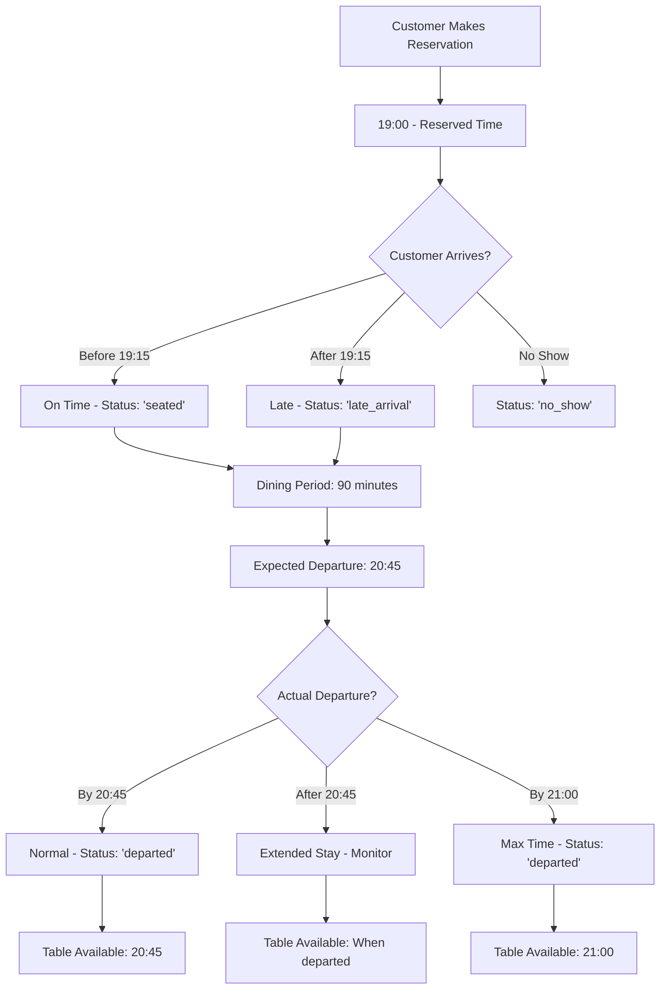
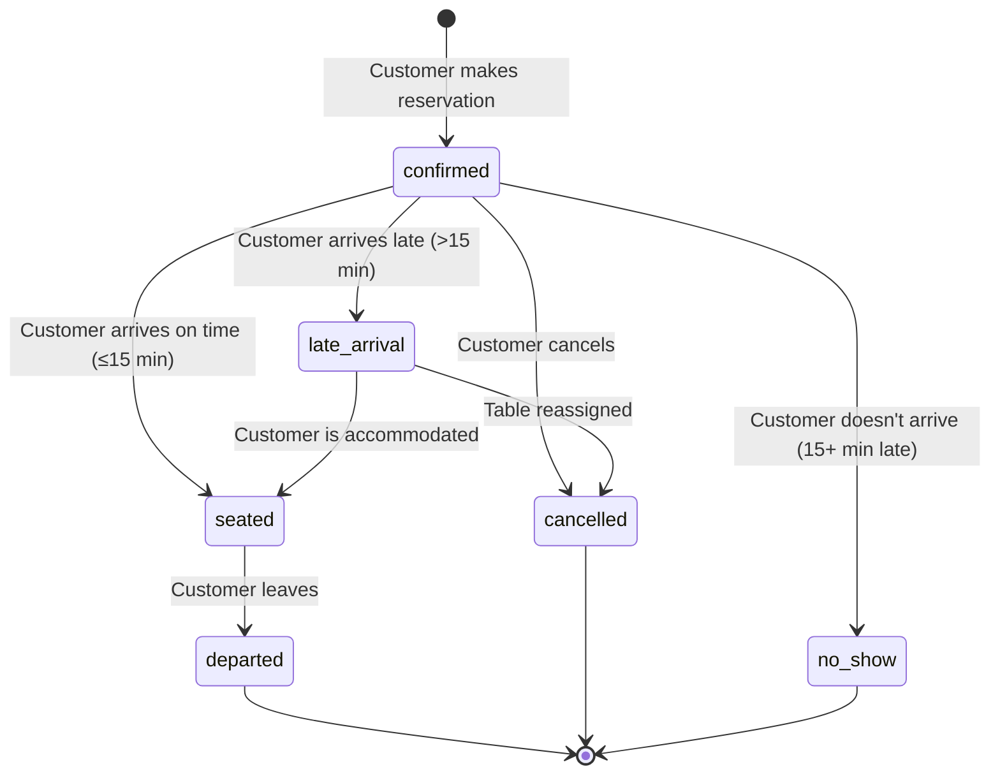

# 🍕 OrderFlow Reservation System Documentation

## 📋 Table of Contents
1. [Overview](#overview)
2. [Duration Logic](#duration-logic)
3. [Database Schema](#database-schema)
4. [Time Slot Management](#time-slot-management)
5. [Availability Calculation](#availability-calculation)
6. [Customer Journey](#customer-journey)
7. [API Endpoints](#api-endpoints)
8. [Backend Logic](#backend-logic)
9. [Frontend Components](#frontend-components)
10. [Admin Dashboard](#admin-dashboard)
11. [Business Rules](#business-rules)
12. [Migration Guide](#migration-guide)

---

## 🎯 Overview

The OrderFlow Reservation System manages table bookings for the pizza restaurant with sophisticated duration tracking, grace periods, and optimal table utilization.

### Key Features
- **Smart Duration Management**: 105-minute time slots (90 min dining + 15 min buffer)
- **Grace Period Handling**: 15-minute grace period for late arrivals
- **Maximum Sitting Time**: 2-hour maximum per reservation
- **Real-time Availability**: Dynamic calculation of next available slots
- **Status Tracking**: Comprehensive reservation lifecycle management
- **Admin Dashboard**: Full management capabilities for staff

---

## ⏰ Duration Logic

### Core Time Parameters

| Parameter | Duration | Purpose |
|-----------|----------|---------|
| **Dining Time** | 90 minutes | Expected customer dining duration |
| **Buffer Time** | 15 minutes | Table cleaning/preparation between guests |
| **Total Slot** | 105 minutes | Complete reservation slot (90 + 15) |
| **Grace Period** | 15 minutes | Late arrival tolerance |
| **Max Sitting** | 120 minutes | Maximum allowed table occupancy |

### Time Calculation Examples

```sql
-- Example: 7:00 PM Reservation
Reservation Time: 19:00:00
Expected End: 20:45:00 (19:00 + 105 minutes)
Grace Period Until: 19:15:00 (19:00 + 15 minutes)
Max Departure: 21:00:00 (19:00 + 120 minutes)
Next Available: 20:45:00 (for next customer)
```

### Business Logic Flow



---

## 🗄️ Database Schema

### Core Tables

#### `restaurant_tables`
```sql
CREATE TABLE restaurant_tables (
    id SERIAL PRIMARY KEY,
    table_number INTEGER UNIQUE NOT NULL,
    name VARCHAR(100),
    capacity INTEGER NOT NULL CHECK (capacity > 0 AND capacity <= 20),
    min_party_size INTEGER DEFAULT 1,
    is_active BOOLEAN DEFAULT true,
    table_type VARCHAR(50) DEFAULT 'standard', -- standard, window, outdoor, private
    location_description TEXT,
    created_at TIMESTAMP DEFAULT CURRENT_TIMESTAMP,
    updated_at TIMESTAMP DEFAULT CURRENT_TIMESTAMP
);
```

#### `table_reservations` (Enhanced with Duration Logic)
```sql
CREATE TABLE table_reservations (
    id SERIAL PRIMARY KEY,
    user_id INTEGER REFERENCES users(id),
    customer_name VARCHAR(255) NOT NULL,
    customer_email VARCHAR(255) NOT NULL,
    customer_phone VARCHAR(50) NOT NULL,
    reservation_date DATE NOT NULL,
    reservation_time TIME NOT NULL,
    number_of_guests INTEGER NOT NULL CHECK (number_of_guests > 0 AND number_of_guests <= 20),
    special_requests TEXT,
    table_id INTEGER REFERENCES restaurant_tables(id) NOT NULL,
    
    -- Duration Management Fields
    duration_minutes INTEGER DEFAULT 105,           -- Total slot duration
    grace_period_minutes INTEGER DEFAULT 15,        -- Late arrival tolerance
    max_sitting_minutes INTEGER DEFAULT 120,        -- Maximum sitting time
    reservation_end_time TIME,                      -- Calculated end time
    
    -- Tracking Fields
    actual_arrival_time TIMESTAMP,                  -- When customer arrived
    actual_departure_time TIMESTAMP,                -- When customer left
    is_late_arrival BOOLEAN DEFAULT false,          -- Late arrival flag
    arrival_notes TEXT,                             -- Arrival notes
    
    -- Status Management
    status VARCHAR(20) DEFAULT 'confirmed' CHECK (
        status IN ('confirmed', 'cancelled', 'completed', 'no_show', 'seated', 'departed', 'late_arrival')
    ),
    
    created_at TIMESTAMP DEFAULT CURRENT_TIMESTAMP,
    updated_at TIMESTAMP DEFAULT CURRENT_TIMESTAMP
);
```

#### `table_availability`
```sql
CREATE TABLE table_availability (
    id SERIAL PRIMARY KEY,
    table_id INTEGER REFERENCES restaurant_tables(id) ON DELETE CASCADE,
    reservation_date DATE NOT NULL,
    reservation_time TIME NOT NULL,
    is_available BOOLEAN DEFAULT true,
    reservation_id INTEGER REFERENCES table_reservations(id) ON DELETE SET NULL,
    created_at TIMESTAMP DEFAULT CURRENT_TIMESTAMP,
    updated_at TIMESTAMP DEFAULT CURRENT_TIMESTAMP,
    UNIQUE(table_id, reservation_date, reservation_time)
);
```

### Enhanced Views

#### `reservation_summary` (Complete Information View)
```sql
CREATE VIEW reservation_summary AS
SELECT 
    r.id,
    r.customer_name,
    r.customer_email,
    r.customer_phone,
    r.reservation_date,
    r.reservation_time,
    r.reservation_end_time,
    r.duration_minutes,
    r.grace_period_minutes,
    r.max_sitting_minutes,
    r.number_of_guests,
    r.special_requests,
    rt.table_number,
    rt.name as table_name,
    rt.capacity as table_capacity,
    r.status,
    r.actual_arrival_time,
    r.actual_departure_time,
    r.is_late_arrival,
    r.arrival_notes,
    r.created_at,
    
    -- User Information
    CASE 
        WHEN u.id IS NOT NULL THEN CONCAT(u.first_name, ' ', u.last_name)
        ELSE NULL 
    END as registered_user_name,
    u.email as registered_user_email,
    
    -- Calculated Duration Fields
    CASE 
        WHEN r.actual_arrival_time IS NOT NULL AND r.actual_departure_time IS NOT NULL 
        THEN EXTRACT(EPOCH FROM (r.actual_departure_time - r.actual_arrival_time))/60
        ELSE NULL 
    END as actual_duration_minutes,
    
    CASE 
        WHEN r.actual_arrival_time IS NOT NULL 
        THEN EXTRACT(EPOCH FROM (r.actual_arrival_time - (r.reservation_date + r.reservation_time)::TIMESTAMP))/60
        ELSE NULL 
    END as arrival_delay_minutes

FROM table_reservations r
LEFT JOIN users u ON r.user_id = u.id
LEFT JOIN restaurant_tables rt ON r.table_id = rt.id
ORDER BY r.reservation_date DESC, r.reservation_time DESC;
```

---

## 🕐 Time Slot Management

### Available Time Slots
```javascript
const timeSlots = [
    // Lunch Service
    '12:00:00', '12:30:00', '13:00:00', '13:30:00', '14:00:00', '14:30:00',
    
    // Dinner Service  
    '19:00:00', '19:30:00', '20:00:00', '20:30:00', '21:00:00', '21:30:00', '22:00:00'
];
```

### Time Slot Rules

1. **30-Minute Intervals**: All reservations start at predefined 30-minute intervals
2. **Service Periods**: 
   - Lunch: 12:00 PM - 3:00 PM
   - Dinner: 7:00 PM - 10:30 PM
3. **Buffer Time**: 15 minutes between each reservation for table preparation
4. **Overlap Prevention**: New reservations cannot overlap with existing ones + buffer time

### Next Available Slot Algorithm

```sql
-- Function to find next available slot
CREATE OR REPLACE FUNCTION get_next_available_slot(
    p_table_id INTEGER,
    p_date DATE,
    p_after_time TIME DEFAULT '12:00:00'
) RETURNS TIME
```

**Algorithm Logic:**
1. Check each time slot after the specified time
2. Look for overlapping reservations within 105-minute windows
3. Return first available slot or NULL if none found

---

## 📊 Availability Calculation

### Overlap Detection Logic

For any given time slot, check if it conflicts with existing reservations:

```sql
-- Check for slot conflicts
SELECT EXISTS(
    SELECT 1 FROM table_reservations 
    WHERE table_id = p_table_id 
    AND reservation_date = p_date 
    AND status NOT IN ('cancelled', 'no_show', 'departed')
    AND (
        -- New slot falls within existing reservation + buffer
        slot >= reservation_time 
        AND slot < (reservation_time + INTERVAL '105 minutes')::TIME
        OR
        -- Existing reservation falls within new slot + buffer
        reservation_time >= slot 
        AND reservation_time < (slot + INTERVAL '105 minutes')::TIME
    )
) as is_occupied;
```

### Table Utilization Calculation

```sql
-- Calculate daily table utilization
SELECT 
    table_id,
    reservation_date,
    COUNT(*) as total_reservations,
    SUM(duration_minutes) as total_minutes_booked,
    ROUND(
        (SUM(duration_minutes)::FLOAT / (13 * 30)) * 100, 2
    ) as utilization_percentage
FROM table_reservations 
WHERE status NOT IN ('cancelled', 'no_show')
GROUP BY table_id, reservation_date;
```

---

## 👥 Customer Journey

### Reservation States Flow



### State Descriptions

| State | Description | Next States |
|-------|-------------|-------------|
| `confirmed` | Initial reservation state | `seated`, `late_arrival`, `no_show`, `cancelled` |
| `seated` | Customer arrived and is dining | `departed` |
| `late_arrival` | Customer arrived after grace period | `seated`, `cancelled` |
| `departed` | Customer has left the table | Terminal state |
| `cancelled` | Reservation was cancelled | Terminal state |
| `no_show` | Customer never arrived | Terminal state |
| `completed` | Legacy state for completed reservations | Terminal state |

---

## 🔌 API Endpoints

### Customer-Facing APIs (`/api/reservations`)

#### `POST /api/reservations`
Create a new reservation
```javascript
// Request Body
{
    "customerName": "John Doe",
    "customerEmail": "john@example.com", 
    "customerPhone": "+1234567890",
    "reservationDate": "2024-01-15",
    "reservationTime": "19:00:00",
    "numberOfGuests": 4,
    "specialRequests": "Window table preferred"
}

// Response
{
    "success": true,
    "reservation": {
        "id": 123,
        "tableNumber": 5,
        "reservationEndTime": "20:45:00",
        "durationMinutes": 105
    }
}
```

#### `GET /api/reservations/availability/:date`
Get available time slots for a date
```javascript
// Response
{
    "success": true,
    "date": "2024-01-15",
    "availableSlots": [
        {
            "time": "12:00:00",
            "availableTables": [1, 3, 5]
        },
        {
            "time": "19:30:00", 
            "availableTables": [2, 4]
        }
    ]
}
```

### Admin APIs (`/api/admin/reservations`)

#### `GET /api/admin/reservations`
Get reservations with filtering
```javascript
// Query Parameters
?date=2024-01-15&status=confirmed&table_id=5&limit=50&offset=0

// Response
{
    "success": true,
    "data": [
        {
            "id": 123,
            "customerName": "John Doe",
            "reservationTime": "19:00:00",
            "reservationEndTime": "20:45:00",
            "tableNumber": 5,
            "status": "seated",
            "actualArrivalTime": "2024-01-15T19:05:00Z",
            "isLateArrival": false,
            "durationMinutes": 105
        }
    ],
    "pagination": {
        "total": 150,
        "limit": 50,
        "offset": 0
    }
}
```

#### `PUT /api/admin/reservations/:id/arrival`
Mark customer arrival
```javascript
// Request Body
{
    "arrivalTime": "2024-01-15T19:05:00Z",
    "notes": "Arrived early, table ready"
}

// Response
{
    "success": true,
    "isOnTime": true,
    "delayMinutes": 0,
    "newStatus": "seated"
}
```

#### `PUT /api/admin/reservations/:id/departure`
Mark customer departure
```javascript
// Request Body
{
    "departureTime": "2024-01-15T20:30:00Z"
}

// Response
{
    "success": true,
    "actualDuration": "01:25:00",
    "newStatus": "departed"
}
```

---

## ⚙️ Backend Logic

### TableService.js Key Methods

#### Duration-Aware Availability Check
```javascript
async getTimeSlotAvailability(date, excludeReservationId = null) {
    const allTimeSlots = [
        '12:00:00', '12:30:00', '13:00:00', '13:30:00', '14:00:00', '14:30:00',
        '19:00:00', '19:30:00', '20:00:00', '20:30:00', '21:00:00', '21:30:00', '22:00:00'
    ];
    
    const availability = {};
    
    for (const timeSlot of allTimeSlots) {
        // Check for overlapping reservations within 105-minute window
        const occupiedTables = await this.dbPool.query(`
            SELECT DISTINCT table_id 
            FROM table_reservations r
            WHERE r.reservation_date = $1 
            AND r.status NOT IN ('cancelled', 'no_show', 'departed')
            AND ($2 IS NULL OR r.id != $2)
            AND (
                -- New slot overlaps with existing reservation
                $3::TIME >= r.reservation_time 
                AND $3::TIME < (r.reservation_time + INTERVAL '105 minutes')::TIME
                OR
                -- Existing reservation overlaps with new slot
                r.reservation_time >= $3::TIME 
                AND r.reservation_time < ($3::TIME + INTERVAL '105 minutes')::TIME
            )
        `, [date, excludeReservationId, timeSlot]);
        
        // Get available tables for this slot
        const availableTables = await this.getAvailableTablesForSlot(
            date, timeSlot, occupiedTables.rows.map(r => r.table_id)
        );
        
        availability[timeSlot] = availableTables;
    }
    
    return availability;
}
```

#### Smart Table Assignment
```javascript
async findBestAvailableTable(partySize, date, time, excludeTableIds = []) {
    // Find tables that can accommodate party size and are available
    const query = `
        SELECT rt.*, 
               ABS(rt.capacity - $1) as size_difference
        FROM restaurant_tables rt
        WHERE rt.is_active = true 
        AND rt.capacity >= $1
        AND rt.id NOT IN (
            SELECT DISTINCT tr.table_id 
            FROM table_reservations tr
            WHERE tr.reservation_date = $2 
            AND tr.status NOT IN ('cancelled', 'no_show', 'departed')
            AND (
                $3::TIME >= tr.reservation_time 
                AND $3::TIME < (tr.reservation_time + INTERVAL '105 minutes')::TIME
                OR
                tr.reservation_time >= $3::TIME 
                AND tr.reservation_time < ($3::TIME + INTERVAL '105 minutes')::TIME
            )
        )
        AND ($4::INTEGER[] IS NULL OR rt.id != ALL($4))
        ORDER BY size_difference ASC, rt.capacity ASC
        LIMIT 1
    `;
    
    const result = await this.dbPool.query(query, [partySize, date, time, excludeTableIds]);
    return result.rows[0] || null;
}
```

---

## 🖥️ Frontend Components

### ReservationSystem.js (Customer Interface)

#### Duration-Aware Time Display
```javascript
const formatReservationDuration = (time) => {
    const startTime = new Date(`2000-01-01T${time}`);
    const endTime = new Date(startTime.getTime() + 105 * 60000); // Add 105 minutes
    
    return {
        start: startTime.toLocaleTimeString('en-US', { 
            hour: 'numeric', 
            minute: '2-digit',
            hour12: true 
        }),
        end: endTime.toLocaleTimeString('en-US', { 
            hour: 'numeric', 
            minute: '2-digit',
            hour12: true 
        }),
        duration: '1h 45m'
    };
};

// Usage in component
<div className="time-slot-info">
    <span className="time-range">
        {formatReservationDuration(slot.time).start} - {formatReservationDuration(slot.time).end}
    </span>
    <span className="duration">
        ({formatReservationDuration(slot.time).duration} table time)
    </span>
</div>
```

### Reservation Status Components

#### Status Badge Component
```javascript
const ReservationStatusBadge = ({ status, arrivalTime, reservationTime }) => {
    const getStatusConfig = () => {
        switch (status) {
            case 'confirmed':
                return { color: 'blue', text: 'Confirmed' };
            case 'seated':
                return { color: 'green', text: 'Seated' };
            case 'late_arrival':
                const delayMinutes = Math.floor((new Date(arrivalTime) - new Date(reservationTime)) / 60000);
                return { color: 'yellow', text: `Late (${delayMinutes}m)` };
            case 'departed':
                return { color: 'gray', text: 'Departed' };
            case 'no_show':
                return { color: 'red', text: 'No Show' };
            case 'cancelled':
                return { color: 'red', text: 'Cancelled' };
            default:
                return { color: 'gray', text: status };
        }
    };
    
    const { color, text } = getStatusConfig();
    
    return (
        <span className={`px-2 py-1 rounded-full text-xs bg-${color}-100 text-${color}-800`}>
            {text}
        </span>
    );
};
```

---

## 📊 Admin Dashboard

### Reservation Management Features

#### Real-Time Status Board
```javascript
const ReservationStatusBoard = () => {
    const [reservations, setReservations] = useState([]);
    const [realTimeUpdates, setRealTimeUpdates] = useState(true);
    
    useEffect(() => {
        const fetchTodaysReservations = async () => {
            const today = new Date().toISOString().split('T')[0];
            const response = await fetch(`/api/admin/reservations?date=${today}&status=confirmed,seated,late_arrival`);
            const data = await response.json();
            setReservations(data.data);
        };
        
        fetchTodaysReservations();
        
        // Set up real-time updates every 30 seconds
        const interval = setInterval(fetchTodaysReservations, 30000);
        return () => clearInterval(interval);
    }, []);
    
    const markArrival = async (reservationId) => {
        const arrivalTime = new Date().toISOString();
        await fetch(`/api/admin/reservations/${reservationId}/arrival`, {
            method: 'PUT',
            headers: { 'Content-Type': 'application/json' },
            body: JSON.stringify({ arrivalTime })
        });
        // Refresh data
        fetchTodaysReservations();
    };
    
    return (
        <div className="reservation-status-board">
            <h2>Today's Reservations</h2>
            {reservations.map(reservation => (
                <div key={reservation.id} className="reservation-card">
                    <div className="reservation-time">
                        {reservation.reservationTime} - {reservation.reservationEndTime}
                    </div>
                    <div className="customer-info">
                        {reservation.customerName} (Party of {reservation.numberOfGuests})
                    </div>
                    <div className="table-info">
                        Table {reservation.tableNumber}
                    </div>
                    <ReservationStatusBadge 
                        status={reservation.status}
                        arrivalTime={reservation.actualArrivalTime}
                        reservationTime={reservation.reservationTime}
                    />
                    {reservation.status === 'confirmed' && (
                        <button onClick={() => markArrival(reservation.id)}>
                            Mark Arrived
                        </button>
                    )}
                </div>
            ))}
        </div>
    );
};
```

#### Duration Analytics Dashboard
```javascript
const DurationAnalytics = () => {
    const [analytics, setAnalytics] = useState(null);
    
    useEffect(() => {
        const fetchAnalytics = async () => {
            const response = await fetch('/api/admin/reservations/analytics/duration');
            const data = await response.json();
            setAnalytics(data);
        };
        fetchAnalytics();
    }, []);
    
    if (!analytics) return <div>Loading...</div>;
    
    return (
        <div className="duration-analytics">
            <h3>Duration Analytics</h3>
            <div className="metrics-grid">
                <div className="metric">
                    <label>Average Dining Time</label>
                    <value>{analytics.averageDiningMinutes} minutes</value>
                </div>
                <div className="metric">
                    <label>On-Time Arrival Rate</label>
                    <value>{analytics.onTimeArrivalRate}%</value>
                </div>
                <div className="metric">
                    <label>Table Utilization</label>
                    <value>{analytics.tableUtilization}%</value>
                </div>
                <div className="metric">
                    <label>Average Delay (Late Arrivals)</label>
                    <value>{analytics.averageDelayMinutes} minutes</value>
                </div>
            </div>
            
            <div className="charts">
                <DiningDurationChart data={analytics.durationDistribution} />
                <ArrivalTimeChart data={analytics.arrivalPatterns} />
            </div>
        </div>
    );
};
```

---

## 📋 Business Rules

### Reservation Policies

1. **Advance Booking**: Reservations can be made up to 30 days in advance
2. **Same-Day Cutoff**: Same-day reservations accepted until 2 hours before desired time
3. **Party Size Limits**: Maximum 20 guests per reservation
4. **Table Assignment**: Automatic assignment to smallest suitable table
5. **Grace Period**: 15-minute grace period for late arrivals
6. **No-Show Policy**: Marked as no-show if not arrived within 15 minutes

### Duration Management

1. **Standard Duration**: 105 minutes per reservation (90 dining + 15 buffer)
2. **Buffer Time**: 15 minutes between reservations for table preparation
3. **Maximum Sitting**: 2 hours maximum occupancy per table
4. **Early Departure**: Tables become available immediately upon departure
5. **Extended Stays**: Monitor tables exceeding standard duration

### Availability Rules

1. **Time Slots**: Fixed 30-minute intervals only
2. **Service Hours**: 
   - Lunch: 12:00 PM - 3:00 PM
   - Dinner: 7:00 PM - 10:30 PM
3. **Last Seating**: No new reservations after 10:00 PM
4. **Overlap Prevention**: No overlapping reservations within 105-minute windows

---

## 🔄 Migration Guide

### Running the Migration

1. **Backup Current Database**
   ```bash
   # Create backup
   pg_dump -h localhost -U your_user -d orderflow > backup_before_duration.sql
   ```

2. **Run Migration Script**
   ```bash
   # Connect to PostgreSQL
   psql -h localhost -U your_user -d orderflow
   
   # Run the migration
   \i /path/to/reservation_duration_migration.sql
   ```

3. **Verify Migration**
   ```sql
   -- Check new columns exist
   \d table_reservations
   
   -- Test new functions
   SELECT get_next_available_slot(1, CURRENT_DATE, '12:00:00');
   
   -- View updated reservation summary
   SELECT * FROM reservation_summary LIMIT 5;
   ```

### Post-Migration Tasks

1. **Update Backend Code**: Modify TableService.js to use new duration logic
2. **Frontend Updates**: Update reservation components to show duration info
3. **Admin Training**: Train staff on new duration tracking features
4. **Monitor Performance**: Watch for any performance impacts from new queries

### Rollback Plan

If issues arise, you can rollback using:
```sql
-- Remove new columns
ALTER TABLE table_reservations 
DROP COLUMN IF EXISTS duration_minutes,
DROP COLUMN IF EXISTS grace_period_minutes,
DROP COLUMN IF EXISTS max_sitting_minutes,
DROP COLUMN IF EXISTS reservation_end_time,
DROP COLUMN IF EXISTS actual_arrival_time,
DROP COLUMN IF EXISTS actual_departure_time,
DROP COLUMN IF EXISTS is_late_arrival,
DROP COLUMN IF EXISTS arrival_notes;

-- Drop new functions
DROP FUNCTION IF EXISTS get_next_available_slot;
DROP FUNCTION IF EXISTS check_arrival_status;
DROP FUNCTION IF EXISTS mark_table_departed;

-- Restore original constraint
ALTER TABLE table_reservations 
DROP CONSTRAINT IF EXISTS table_reservations_status_check;

ALTER TABLE table_reservations 
ADD CONSTRAINT table_reservations_status_check 
CHECK (status IN ('confirmed', 'cancelled', 'completed', 'no_show'));
```

---

## 🔧 Configuration Options

### Environment Variables

```bash
# Duration Settings (minutes)
RESERVATION_DURATION_MINUTES=105
GRACE_PERIOD_MINUTES=15
MAX_SITTING_MINUTES=120

# Service Hours
LUNCH_START_TIME=12:00:00
LUNCH_END_TIME=14:30:00
DINNER_START_TIME=19:00:00
DINNER_END_TIME=22:00:00

# Business Rules
MAX_ADVANCE_BOOKING_DAYS=30
SAME_DAY_CUTOFF_HOURS=2
MAX_PARTY_SIZE=20
```

### Customizable Duration Rules

The system supports different duration rules per table type:

```sql
-- Example: VIP tables with longer duration
UPDATE table_reservations 
SET duration_minutes = 150, max_sitting_minutes = 180 
WHERE table_id IN (
    SELECT id FROM restaurant_tables 
    WHERE table_type = 'private'
);
```

---

## 📈 Performance Considerations

### Database Indexes

The migration adds several indexes for optimal performance:

```sql
-- Duration-related indexes
CREATE INDEX idx_reservations_end_time ON table_reservations(reservation_date, reservation_end_time);
CREATE INDEX idx_reservations_duration ON table_reservations(duration_minutes);
CREATE INDEX idx_reservations_arrival_time ON table_reservations(actual_arrival_time);
CREATE INDEX idx_reservations_departure_time ON table_reservations(actual_departure_time);
```

### Query Optimization Tips

1. **Date Range Queries**: Always include date filters for large datasets
2. **Status Filtering**: Use status indexes for efficient filtering
3. **Availability Checks**: Cache availability results for popular dates
4. **Real-time Updates**: Use efficient polling intervals (30-60 seconds)

---

## 🚨 Troubleshooting

### Common Issues

#### 1. No Available Tables Found
```sql
-- Debug: Check existing reservations for a date/time
SELECT * FROM table_reservations 
WHERE reservation_date = '2024-01-15' 
AND reservation_time <= '19:30:00'::TIME + INTERVAL '105 minutes'
AND (reservation_time + INTERVAL '105 minutes')::TIME > '19:30:00'::TIME;
```

#### 2. Duration Calculation Errors
```sql
-- Verify end time calculations
SELECT 
    id,
    reservation_time,
    reservation_end_time,
    (reservation_time + INTERVAL '105 minutes')::TIME as calculated_end_time
FROM table_reservations 
WHERE reservation_end_time != (reservation_time + INTERVAL '105 minutes')::TIME;
```

#### 3. Late Arrival Detection Issues
```sql
-- Check grace period calculations
SELECT 
    id,
    customer_name,
    reservation_time,
    actual_arrival_time,
    is_late_arrival,
    EXTRACT(EPOCH FROM (actual_arrival_time - (reservation_date + reservation_time)::TIMESTAMP))/60 as actual_delay_minutes
FROM table_reservations 
WHERE actual_arrival_time IS NOT NULL;
```

---

## 📞 Support & Maintenance

### Regular Maintenance Tasks

1. **Clean Old Reservations**: Archive completed reservations older than 1 year
2. **Update Analytics**: Refresh analytics views daily
3. **Monitor Performance**: Check query performance weekly
4. **Backup Strategy**: Daily incremental backups, weekly full backups

### Monitoring Alerts

Set up alerts for:
- High table utilization (>85%)
- Frequent late arrivals (>20% per day)
- Extended stays (>130 minutes average)
- System performance degradation

---

## 🎯 Future Enhancements

### Planned Features

1. **Dynamic Pricing**: Adjust pricing based on demand and duration
2. **AI Optimization**: Machine learning for optimal table assignments
3. **Mobile Notifications**: Real-time updates to customers
4. **Integration APIs**: Connect with external restaurant management systems
5. **Advanced Analytics**: Predictive analytics for demand forecasting

### Extensibility Points

The system is designed to be extensible:
- Custom duration rules per table type
- Flexible time slot configurations
- Pluggable notification systems
- Configurable business rules

---

*This documentation covers the complete OrderFlow Reservation System with duration management. For technical support, contact the development team.*

**Last Updated**: December 2024  
**Version**: 2.0 (Duration-Aware)
